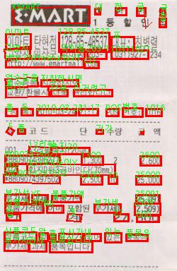

# PaddleOCR 한글 인식 및 시각화  

🚀 **PaddleOCR을 활용하여 이미지 내 텍스트를 인식하고 Bounding Box를 표시하는 프로젝트**입니다.  
이 코드를 실행하면 **이미지 속 텍스트를 감지하고, 해당 위치를 시각적으로 표시**할 수 있습니다.  


> 이 코드에 대한 블로그 포스팅은 [PaddleOCR: 오픈소스 OCR 프레임워크 활용](https://blog.tinstack.net/posts/42)를 참고하세요.


---

## 📷 결과 예시  
  

---

## 🛠 설치 방법  

이 프로젝트를 실행하려면 **Python 3.7+** 환경이 필요합니다.  
필요한 라이브러리는 다음 명령어로 설치할 수 있습니다.  

```bash
pip install paddlepaddle paddleocr opencv-python numpy pillow

```

---

## 📌 기능

✅ 이미지 내 텍스트 검출
✅ Bounding Box 시각화
✅ PIL을 활용한 결과 이미지 저장
✅ 다국어 지원 가능 (PaddleOCR의 lang 옵션 활용)

---

## ⚡ 관련 블로그

[PaddleOCR: 오픈소스 OCR 프레임워크 활용](https://blog.tinstack.net/posts/42)

---


## 📜 라이선스
이 프로젝트는 MIT License를 따릅니다. 자유롭게 사용하고 개선할 수 있습니다.

